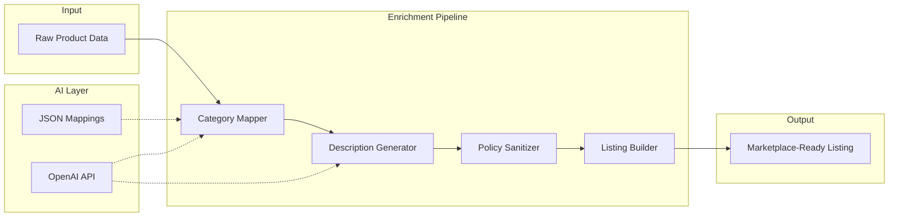

# AI Product Enrichment Pipeline

**Transform raw product data into marketplace-ready listings using AI-powered categorization, description generation, and policy compliance.**


---

## What it does

Takes raw product data (e.g. from Amazon, supplier manifests, or any catalog) and automatically generates everything needed for marketplace listings:

- **Categorization** — Maps source categories to marketplace taxonomy using a 3-tier hierarchy: direct JSON mapping → AI classification → department fallback
- **Title & description generation** — Produces optimized titles (max 50 chars), keyword-rich descriptions, hashtags, and brand/model extraction via structured OpenAI prompts
- **Duplicate prevention** — Accepts existing titles from the same store to ensure the AI generates unique titles for identical products
- **Policy compliance** — Regex-based sanitizer catches 25+ patterns that trigger marketplace policy violations (satellite receivers, spy cameras, exam cheating devices, etc.)
- **Listing assembly** — Formats the final listing with condition-based headers, structured sections, and keyword blocks

Built from a production system processing **5,000+ products** across multiple marketplace accounts.

## Architecture



## Features

- **Idempotent pipeline** — Only writes empty fields, never overwrites existing data. Safe to re-run on the same products.
- **3-tier categorization** — Direct mapping (instant, free) → AI classification (accurate, costs tokens) → fallback (always succeeds). Optimizes for both cost and accuracy.
- **Structured JSON output** — Uses OpenAI's `response_format: json_object` for reliable parsing, no fragile regex on LLM output.
- **Title deduplication** — Pass existing titles and the AI will generate distinct titles for identical products (different model numbers, capacities, etc.).
- **25+ policy rules** — Regex patterns ordered longest-first to avoid partial matches. Handles Spanish marketplace-specific terms.
- **Condition-aware formatting** — Listings automatically get emoji prefixes and warning blocks based on product condition (perfect/damaged/for parts).
- **Framework-agnostic** — Works with any data source: ORM models, dicts, dataclasses, `SimpleNamespace`. No database dependency.

## Quick start

```bash
git clone https://github.com/AspiranteD/ai-product-enrichment.git
cd ai-product-enrichment
pip install -r requirements.txt
cp .env.example .env  # add your OpenAI API key
```

Run the example:

```bash
export OPENAI_API_KEY=sk-...
python examples/enrich_product.py
```

Run tests (no API key needed — all AI calls are mocked):

```bash
pytest tests/ -v
```

## Usage

### Full pipeline

```python
from types import SimpleNamespace
from src.enrichment import enrich_item

product = SimpleNamespace(
    product_id="B08N5WRWNW",
    source_description="Sony WH-1000XM4 Wireless Noise Canceling Headphones",
    source_features="30-hour battery; Touch controls; Speak-to-Chat",
    source_department="Electronics",
    source_category="Headphones",
    source_subcategory="Over-Ear",
    marketplace_category=None,
    marketplace_title=None,
    marketplace_description=None,
    keywords=None,
    short_description=None,
    related_keywords=None,
    hashtags=None,
    brand=None,
    model=None,
    color=None,
)

result = enrich_item(product)
# result = {"product_id": "B08N5WRWNW", "categorization": "ok", "description": "ok", "success": True, ...}
# product.marketplace_title = "Sony WH-1000XM4 auriculares inalámbricos"
# product.brand = "Sony"
# product.model = "WH-1000XM4"
```

### Individual components

```python
from src.enrichment import CategoryMapper, generate_listing_content, sanitize_text

# Categorize
mapper = CategoryMapper()
category = mapper.classify("Electronics", "Headphones", description="Wireless noise canceling")

# Generate content
content = generate_listing_content(
    description="Sony WH-1000XM4 Premium Noise Canceling Headphones",
    features="30-hour battery; LDAC; Multipoint",
    existing_titles=["Sony WH-1000XM4 auriculares Bluetooth"],  # avoid duplicates
)

# Sanitize for policy compliance
clean = sanitize_text("Receptor satélite HD decodificador IPTV")
# -> "sintonizador TDT HD sintonizador televisión"
```

## Project structure

```
ai-product-enrichment/
├── src/
│   └── enrichment/
│       ├── pipeline.py              # Orchestrator (enrich_item)
│       ├── category_mapper.py       # 3-tier categorization
│       ├── description_generator.py # OpenAI content generation
│       ├── listing_builder.py       # Formatted listing assembly
│       ├── policy_sanitizer.py      # Regex-based compliance filter
│       └── openai_client.py         # Reusable OpenAI wrapper
├── data/
│   ├── category_mapping.json        # Direct mapping table
│   └── category_taxonomy.json       # Marketplace category tree
├── tests/
│   ├── test_pipeline.py
│   ├── test_category_mapper.py
│   ├── test_policy_sanitizer.py
│   └── test_listing_builder.py
├── examples/
│   └── enrich_product.py
├── .env.example
└── requirements.txt
```

## Design decisions

**Why a 3-tier categorization hierarchy?**
Direct JSON mapping handles 70% of products instantly (free, deterministic). AI handles the remaining 30% that need semantic understanding. Fallback ensures 100% coverage — no product ever fails to categorize. This reduced our OpenAI costs by ~70% vs. classifying everything with AI.

**Why regex-based policy sanitization instead of AI?**
Marketplace policy violations are deterministic — "satellite receiver" is always a problem. Regex is instant, free, and testable. Using AI for this would add latency, cost, and non-determinism for a problem that doesn't need it.

**Why structured JSON output from OpenAI?**
Using `response_format: json_object` eliminates the need to parse free-text responses. No regex extraction, no "please format as JSON" prompt hacks. The response is always valid JSON or an API error — no in-between states to handle.

**Why idempotent steps?**
In production, enrichment runs on thousands of products via a scheduled queue. If a step fails mid-batch, re-running the entire batch must be safe. Each step checks if its output fields are already populated and skips if so.

## Built with

- **Python 3.11+** — Type hints, structural pattern matching
- **OpenAI API** — GPT-4o-mini for categorization and description generation
- **pytest** — Unit tests with mocked AI calls

## Part of a larger system

This enrichment pipeline is one component of a multi-marketplace e-commerce automation system that includes:

- [**amazon-product-scraper**](https://github.com/AspiranteD/amazon-product-scraper) — Feeds raw product data into this pipeline
- [**wallapop-data-extractors**](https://github.com/AspiranteD/wallapop-data-extractors) — Extracts orders, chats, and listings from marketplace APIs
- [**ebay-automation-toolkit**](https://github.com/AspiranteD/ebay-automation-toolkit) — Bulk listing and order management via eBay APIs
- [**marketplace-sync-engine**](https://github.com/AspiranteD/marketplace-sync-engine) — Cross-platform inventory synchronization

## License

MIT
